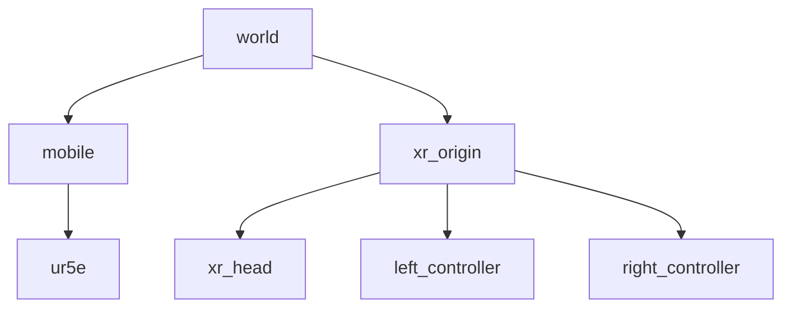

# Unity 클라이언트 제작기

## 1. PCD 데이터 띄우기

- ROS2 서버 사용
- ROS2 서버에 Service 요청 보내서 받아오는 구조
- 받아온 PointCloud2를 랜더링
- vr내에서 downsampling parameter 추가

-> 데이터 그대로 사용하면 랜더링 개 느릴 가능성 있음. 필요할 경우 다운샘플링 수행
-> Publish로 주기적으로 하면 네트워크 죽음

## 2. Mobile Base & Manipulator (UR5e) 띄우기

- ROS2 서버 사용
- Mobile Base는 Odometry or PoseStamp 메세지 Subscribe 받아서 "반영"
- Manipulator는 JointState 메세지 Subscribe 받아서 "반영"

## 3. JoyStick 메시지 발행

- 오른쪽, 왼쪽 컨트롤러 메시지 발행 (손 아님, 컨트롤러)
- Joy 메시지 타입 -> 컨트롤러 조이스틱 상태 (버튼 + 조이스틱)
- 컨트롤러 "Pose" 발행 (Player 원점에 대하여 Local Pose)

---
pcd 발행 방법

ros2 service call /publish_pcd_trigger std_srvs/srv/Trigger

----

## TF Tree

---
## UR5e move

- joint state의 name filed 이름 mapping함
- 오른쪽 컨트롤러의 그립 버튼을 누른 상태에서 움직이면 pose delta만큼을 manipulator의 EE에 더하여 servoJ로 움직임.
- mobile이 움직일때 원하는 move가 나오게 mobile <-> xr_origin TF Rotate만큼을 pose delta에 반영함.
- 움직임에서 singularity, safety error에 try구문으로 에러 회피

## 필요한거
- singularity, safety error가 나오면 더이상 움직이지 않으려함.

## 실행 방법
ros2 run ros_tcp_endpoint default_server_endpoint 
//ros tcp 실행

ros2 run unity_ros_client pcd_custom_service
//pcd loading및 publisher
## 0325

실제 joint state랑 mobile pose를 받아올꺼니까, unity client똑에서 topic명 변경해야됨. 
joint state name field 순서가 뒤죽박죽이니까 알잘딱깔센으로 적용되게 .

pcd service를 커스텀으로 바꿔서 다운샘플링 파라미터도 받아서 할수있게(유니티에서 해도 나음) 그리고 발행된게 유니티에서 받았는지 몰르니까 여러번 발행도 생각.

---이번주 내
ur control = rtde 라는거 쓸거임
ur5e ursim 써서 오른쪽 컨트롤러 pose, joy(특정 버튼 누르고 있는 동안)를 받아서, 그동안 움직인 변화량 (pose delta)받아서 매니퓰레이터 엔드 이펙트에 적용 => "moveL쓰지 말것"
RTDE Control Interface API

------
ros2 service call /publish_pcd_custom unity_ros_interfaces/srv/PcdService "{trigger: true, index: -1, sampling_value: 0}"
